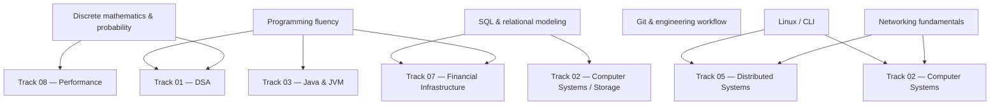

# Track 00 — Foundations

> Build only the foundations required to enter the core FIE curriculum at full depth. Do not use this track to relearn skills that are already demonstrably mastered.

## Mission

Track 00 exists to remove hidden prerequisites that would otherwise make later subjects artificially difficult.

It is intentionally **diagnostic and selective** for an experienced backend engineer. The goal is not to complete introductory courses for their own sake. The goal is to establish a reliable baseline for:

- algorithms and complexity
- computer systems
- databases and data modeling
- Linux / command-line engineering
- version control and reproducible engineering workflows
- discrete mathematics and probability
- basic networking mental models

## The key principle: validate before studying

For every foundation area:

```text
Existing experience
      ↓
Diagnostic questions / task
      ↓
Gap classification
      ↓
Targeted resource
      ↓
Small proof
      ↓
Move on
```

If the diagnostic is passed convincingly, the corresponding introductory material is **skipped**.

## Dependency graph



## Subtracks

| Module | Purpose | Expected action for an experienced Java backend engineer |
|---|---|---|
| 00.1 Programming & computational fluency | Ensure language-independent problem-solving fluency | **Diagnostic / targeted gaps only** |
| 00.2 Discrete mathematics & probability | Establish the mathematical language for algorithms and systems | **Diagnostic → study gaps** |
| 00.3 SQL & relational data modeling | Ensure strong relational foundations for financial systems | **Likely targeted refresh** |
| 00.4 Linux, CLI & developer tooling | Make the operating environment transparent | **Targeted refresh** |
| 00.5 Git & engineering workflow | Ensure reproducible, inspectable engineering work | **Targeted refresh** |
| 00.6 Networking fundamentals | Establish the minimum mental model before Computer Systems | **Diagnostic / targeted gaps** |

## What is deliberately NOT here?

The following are intentionally deferred to later tracks:

- deep algorithms → Track 01
- CPU architecture → Track 02
- operating-system internals → Track 02
- TCP internals and advanced networking → Track 02
- JVM internals → Track 03
- advanced concurrency → Track 04
- distributed systems → Track 05
- cloud/Kubernetes → Track 06
- financial-domain depth → Track 07
- performance engineering → Track 08
- AI → Track 09

Track 00 should **not become a second computer-science degree**.

## Exit criteria

Before entering Track 01, you should be able to:

1. reason about time and space complexity at a basic level;
2. read and write mathematical notation used in algorithms;
3. use sets, functions, relations, graphs, induction, counting, and basic probability;
4. model a small relational domain and write non-trivial SQL queries;
5. work fluently from a shell and inspect processes/files/network state;
6. use Git confidently, including branching, rebasing, history inspection, and recovery;
7. explain the basic path of a request through an application, network, and database;
8. write small programs/scripts in a language other than Java when useful for experiments;
9. distinguish a genuine knowledge gap from a topic that is merely unfamiliar vocabulary.

## Primary resources

The current candidates are deliberately chosen for **structure + free accessibility + exercises**, not because they are fashionable.

### Discrete mathematics

**Primary:** MIT 6.042J — *Mathematics for Computer Science*.

MIT's course explicitly covers definitions, proofs, sets, functions, relations, discrete structures, graphs, state machines, modular arithmetic, counting, and discrete probability. It is designed as preparation for later computer-science subjects including algorithms and computer systems. The Open Learning Library version is free. citeturn0search3turn0search6turn0search14

### SQL

**Primary:** Harvard CS50's *Introduction to Databases with SQL*.

It provides a structured seven-part progression from querying and relational concepts through database design, writing, viewing, optimization, and scaling. It includes problem sets and a final project, and the course is free to take; CS50 also offers a free certificate when the completion requirements are met. citeturn1search0turn1search4turn1search5

### Linux / CLI / engineering tools

**Primary:** MIT *The Missing Semester of Your CS Education*.

It specifically addresses shell tools, scripting, editors, command-line environments, Git, debugging/profiling, build systems, testing, CI, security, and related developer tooling. This is a much better fit for Track 00 than a generic Linux administration course because the target is engineering fluency. citeturn2search12

### Git

**Primary:** *Pro Git*.

The complete book is freely available and covers Git basics, branching, distributed workflows, GitHub, advanced tools, and Git internals. Its explanation of Git's snapshot model, staging area, object database, and local-first behavior is particularly useful because later systems work benefits from understanding the abstraction rather than memorizing commands. citeturn2search0turn2search4turn2search11

### Algorithms prerequisite

**Reference target:** MIT 6.006 — *Introduction to Algorithms*.

We do not treat 6.006 as a Track 00 course. Instead, its stated prerequisites define an important readiness test: strong programming plus discrete mathematics. The course then moves into mathematical modeling, algorithms, data structures, and performance analysis. citeturn0search9turn0search1

## Completion rule

Track 00 is complete when the learner can demonstrate the exit criteria, not when every linked course has been watched.

A passed diagnostic should result in:

> **SKIP — already mastered**

A partial result should result in:

> **TARGETED STUDY — specific gaps identified**

Only a fundamental weakness should result in:

> **FULL MODULE — complete the structured resource**

## Evidence artifact

Create `00-foundations/evidence/foundations-readiness.md` containing:

- diagnostic results
- identified gaps
- resources actually completed
- short proof for each remediated gap
- remaining assumptions entering Track 01

The purpose is to make the transition into Track 01 explicit rather than relying on intuition.

## Status

- [x] Track scope defined
- [x] Dependency graph defined
- [x] Diagnostic-first philosophy defined
- [x] Initial primary resources researched
- [ ] 00.1 Programming diagnostic
- [ ] 00.2 Mathematics diagnostic
- [ ] 00.3 SQL diagnostic
- [ ] 00.4 Linux / CLI diagnostic
- [ ] 00.5 Git diagnostic
- [ ] 00.6 Networking diagnostic
- [ ] Foundations readiness evidence
