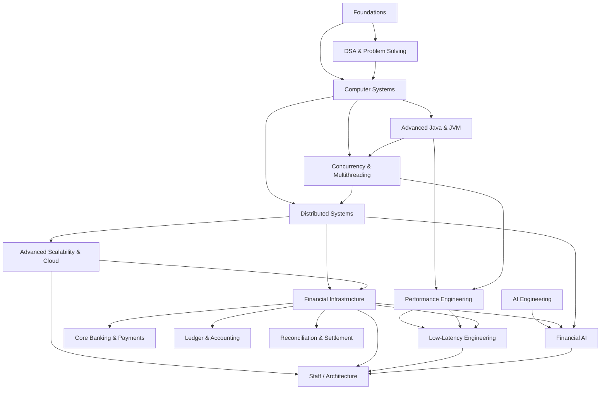

# Financial Infrastructure Engineering (FIE)

> A rigorous, evidence-driven curriculum for becoming an elite Financial Infrastructure Engineer at the intersection of **Software Engineering × Distributed Systems × Finance × AI**.

This repository is not an "awesome list" and not a collection of course links. It is a structured learning system designed to answer, for every subject:

- **Why does this matter?**
- **Why learn it now?**
- **What are the prerequisites?**
- **What exactly must I understand?**
- **Which resource gives the strongest learning path?**
- **How do I practice it?**
- **How do I prove mastery?**
- **How does it connect to financial infrastructure?**
- **What does Staff-level understanding look like?**

## North Star

Become capable of designing, implementing, operating, and evolving systems that move, store, reconcile, and reason about money under **concurrency, failure, scale, latency, regulatory, and adversarial constraints** — while developing strong AI engineering capabilities.

## Curriculum map

## Tracks

| Track | Domain | Purpose |
|---|---|---|
| 00 | Foundations | Establish the mathematical, programming, data, and networking prerequisites |
| 01 | DSA & Problem Solving | Build algorithmic reasoning and implementation fluency |
| 02 | Computer Systems | Understand CPU, memory, OS, networking, storage, and system boundaries |
| 03 | Advanced Java & JVM | Master the runtime used to build production financial systems |
| 04 | Concurrency & Multithreading | Reason about correctness, contention, parallelism, and high-throughput execution |
| 05 | Distributed Systems | Master consistency, replication, messaging, coordination, and failure |
| 06 | Advanced Scalability & Cloud | Build reliable, observable, cost-aware systems at scale |
| 07 | Financial Infrastructure | Understand core banking, payments, ledgers, settlement, reconciliation, risk, and controls |
| 08 | Performance & Low Latency | Engineer predictable high performance from CPU to distributed service |
| 09 | AI Engineering | Build production-grade ML, LLM, RAG, agentic, inference, and evaluation systems |
| 10 | Financial AI | Apply AI to fraud, risk, anomaly detection, operations, and financial decision systems |
| 11 | Architecture & Staff Engineering | Integrate technical depth, trade-offs, system design, and technical leadership |
| 12 | Capstone Projects | Turn knowledge into difficult, public, measurable proof-of-work |
| 13 | Evidence & Credentials | Track certifications, projects, benchmarks, writing, OSS, and external signals |

## Learning levels

- **L0 — Awareness:** can define the concept and identify where it appears.
- **L1 — Foundation:** can explain the core model and solve basic exercises.
- **L2 — Practitioner:** can implement and debug the concept in a real project.
- **L3 — Advanced:** can reason about edge cases, performance, and failure modes.
- **L4 — Senior:** can make sound design decisions under realistic constraints.
- **L5 — Staff:** can establish boundaries, evaluate trade-offs, anticipate second-order effects, and guide system evolution.
- **L6 — Expert / Architect:** can evaluate novel problems, contribute original designs or technology, and teach the subject deeply.

## Evidence model

Learning is considered incomplete until it produces evidence appropriate to the subject:

**Learn → Practice → Build → Measure → Explain → Publish**

Possible evidence includes:

- university assignments or labs
- production-quality implementations
- benchmarks and performance reports
- architecture decision records
- technical articles
- open-source contributions
- research-paper reproductions
- certifications where they provide meaningful external signal
- capstone systems with documented trade-offs

## Repository conventions

Each module should answer the same questions and follow the same structure:

1. Why does this exist?
2. Why does it matter for FIE?
3. Prerequisites
4. Why learn it at this point?
5. Learning objectives
6. Fundamental questions
7. Concepts in dependency order
8. Primary resource
9. Supporting resources
10. Practice / labs
11. Proof of mastery
12. Financial infrastructure applications
13. Staff-level expectations
14. Evidence to publish
15. Common misconceptions / failure modes
16. Further research

Resource selection follows a **primary-resource-first** rule: one best structured resource is preferred over an uncurated list, with alternatives used when they improve depth, accessibility, implementation, or perspective.

## Current starting point

The initial financial-infrastructure objectives live under [`readings/`](./readings/). They will be progressively reorganized into the curriculum once the foundation and dependency graph are stable.

## Guiding principles

1. **Correctness before scale.**
2. **Understand the abstraction before the tool.**
3. **Understand the machine before optimizing the framework.**
4. **Learn concepts through dependencies, not popularity.**
5. **Prefer primary sources and rigorous courses.**
6. **Use projects to force integration across domains.**
7. **Treat financial correctness, auditability, recoverability, and compliance as first-class engineering constraints.**
8. **Certifications are signals, not substitutes for competence.**
9. **Staff-level mastery requires judgment and trade-off reasoning, not memorization.**
10. **Every major claim and resource recommendation should be reviewable and evidence-backed.**
