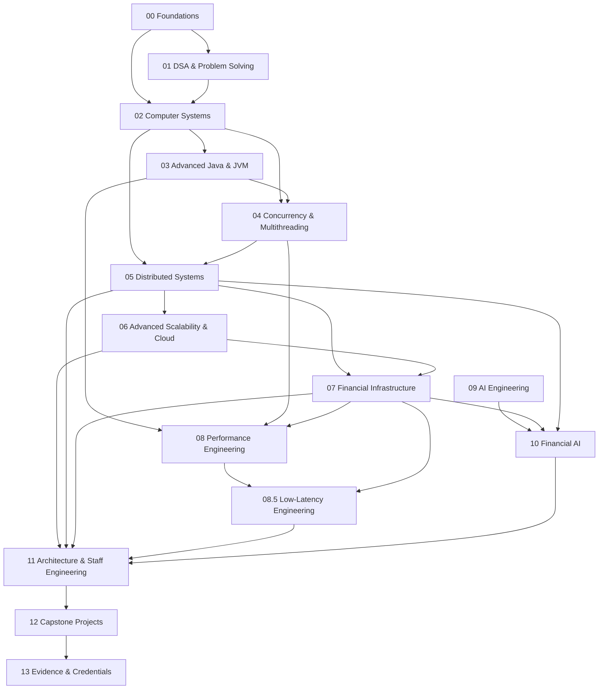

# Financial Infrastructure Engineering Roadmap

> Master map of the FIE learning journey. This document shows **what comes before what, why the dependency exists, and where each capability ultimately leads**.

## Global dependency graph



## Track sequence

### Track 00 — Foundations

**Question:** What must be true before advanced systems concepts can be learned efficiently?

Focus:

- programming fundamentals where gaps exist
- discrete mathematics
- probability and statistics where relevant
- SQL and data modeling
- networking fundamentals
- Linux / command line
- Git and engineering workflow

**Exit condition:** can reason comfortably about programs, data, networks, and basic system behavior.

---

### Track 01 — DSA & Problem Solving

**Question:** How do we model problems and choose efficient representations and algorithms?

Progression:

```text
Complexity
→ Data structures
→ Searching / sorting
→ Recursion / backtracking
→ Trees
→ Heaps
→ Hashing
→ Graphs
→ Dynamic programming
→ Advanced algorithms
→ Problem-solving patterns
```

Primary role: develop algorithmic reasoning, not merely interview pattern memorization.

**Feeds:** Computer Systems, Distributed Systems, Performance, interviews.

---

### Track 02 — Computer Systems

**Question:** What is actually happening beneath application-level abstractions?

Progression:

```text
Computer architecture
→ CPU / caches / memory hierarchy
→ Operating systems
→ Processes / threads
→ Virtual memory
→ I/O
→ Networking
→ Storage systems
```

**Feeds:** JVM, concurrency, distributed systems, performance, low latency.

---

### Track 03 — Advanced Java & JVM

**Question:** How does the Java runtime behave, and how does that affect production systems?

Progression:

```text
Modern Java
→ Collections / generics
→ JVM architecture
→ Bytecode
→ JIT compilation
→ Memory allocation
→ Garbage collection
→ Profiling
→ JVM observability
```

**Feeds:** concurrency, performance, low latency.

---

### Track 04 — Concurrency & Multithreading

**Question:** How do we safely and efficiently execute work concurrently?

Progression:

```text
Threads
→ Java Memory Model
→ happens-before
→ visibility / atomicity
→ synchronized / locks
→ atomics / CAS
→ concurrent collections
→ executors
→ ForkJoin / work stealing
→ contention
→ false sharing
→ lock-free algorithms
→ parallelism
```

**Feeds:** distributed systems, performance, low latency, financial transaction processing.

---

### Track 05 — Distributed Systems

**Question:** How do we build correct systems when machines, networks, and processes can fail independently?

Progression:

```text
Distributed-system model
→ failure models
→ clocks / ordering
→ RPC
→ replication
→ consistency
→ partitioning
→ consensus
→ distributed transactions
→ messaging
→ event-driven systems
→ fault tolerance
→ recovery
```

**Feeds:** scalability, financial infrastructure, architecture.

---

### Track 06 — Advanced Scalability & Cloud

**Question:** How do systems scale while remaining reliable, observable, secure, and economically viable?

Progression:

```text
Capacity planning
→ stateless services
→ load balancing
→ caching
→ queues / streams
→ database scaling
→ partitioning / sharding
→ autoscaling
→ containers
→ Kubernetes
→ cloud architecture
→ observability
→ SLOs / reliability
→ multi-region
→ disaster recovery
→ cost engineering
```

**Feeds:** financial infrastructure and Staff-level architecture.

---

### Track 07 — Financial Infrastructure

**Question:** How do we engineer systems that can be trusted with money?

Progression:

```text
Financial domain model
→ core banking
→ accounts / balances
→ double-entry ledger
→ transaction posting
→ payment lifecycle
→ authorization / capture
→ settlement
→ reconciliation
→ fees / FX
→ limits / exposure
→ risk / fraud
→ compliance / auditability
→ financial data integrity
```

Cross-cutting invariants:

- no money creation or destruction by accident
- idempotent financial actions
- explicit state machines
- immutable accounting history
- transactional integrity
- auditability
- recoverability
- reconciliation

This track becomes the primary domain laboratory for the entire curriculum.

---

### Track 08 — Performance Engineering

**Question:** How do we measure and systematically improve system performance?

Progression:

```text
Performance model
→ measurement
→ profiling
→ CPU behavior
→ memory behavior
→ cache locality
→ allocation
→ GC
→ JIT
→ synchronization costs
→ throughput / latency trade-offs
→ benchmarking
→ performance regression analysis
```

**Feeds:** low latency and production optimization.

---

### Track 08.5 — Low-Latency Engineering

**Question:** How do we build systems where predictable latency matters as much as throughput?

Progression:

```text
Latency decomposition
→ tail latency
→ CPU cycles
→ cache locality
→ allocation avoidance
→ GC control
→ lock contention
→ lock-free structures
→ batching trade-offs
→ queues / ring buffers
→ networking
→ kernel / I/O effects
→ JVM low-latency techniques
→ end-to-end latency budgets
```

Applications:

- payment authorization
- market data
- trading infrastructure
- risk checks
- transaction processing
- high-throughput event pipelines

---

### Track 09 — AI Engineering

**Question:** How do we build reliable AI systems rather than simply call models?

Progression:

```text
ML foundations
→ data pipelines
→ model fundamentals
→ deep learning foundations
→ transformers
→ LLMs
→ embeddings
→ retrieval
→ RAG
→ tool use
→ agents
→ inference
→ evaluation
→ observability
→ security
→ cost / latency
→ production AI systems
```

---

### Track 10 — Financial AI

**Question:** Where does AI create real value in financial infrastructure, and how do we deploy it safely?

Applications:

- fraud detection
- transaction anomaly detection
- risk scoring
- credit decisioning
- AML investigation support
- reconciliation automation
- operations intelligence
- financial document intelligence
- payment routing optimization
- forecasting

The engineering emphasis remains on correctness, explainability where required, evaluation, monitoring, latency, security, and controlled failure.

---

### Track 11 — Architecture & Staff Engineering

**Question:** How does an experienced engineer move from solving problems to defining systems and technical direction?

Focus:

- architecture principles
- system design
- trade-off analysis
- architecture decision records
- technical strategy
- evolution of large systems
- organizational boundaries
- reliability strategy
- platform thinking
- technical leadership
- communication
- mentoring
- technical influence

**Exit condition:** can independently frame ambiguous technical problems, establish constraints, make durable decisions, and communicate them across engineering and business stakeholders.

---

### Track 12 — Capstone Projects

Projects integrate multiple tracks and must produce public evidence.

Candidate capstones:

1. production-grade double-entry ledger
2. payment orchestration platform
3. distributed reconciliation engine
4. high-throughput concurrent transaction processor
5. low-latency event-processing engine
6. cloud-native financial platform
7. AI-powered fraud/risk system
8. end-to-end financial infrastructure platform

Projects should include tests, benchmarks, architecture diagrams, ADRs, failure analysis, and technical documentation.

---

### Track 13 — Evidence & Credentials

**Question:** How do we make competence externally legible?

Evidence categories:

- certifications
- course completion where meaningful
- university assignments
- GitHub projects
- benchmarks
- technical articles
- research reproductions
- open-source contributions
- conference / meetup talks
- architecture documents
- external reviews

Credentials are tracked separately from demonstrated capability.

## Dependency rule

A later topic may be studied early for context, but it should not be considered mastered until its relevant prerequisites are satisfied.

## Roadmap status

- [x] Curriculum architecture defined
- [x] Master dependency graph defined
- [ ] Track 00 detailed curriculum
- [ ] Track 01 detailed curriculum
- [ ] Track 02 detailed curriculum
- [ ] Track 03 detailed curriculum
- [ ] Track 04 detailed curriculum
- [ ] Track 05 detailed curriculum
- [ ] Track 06 detailed curriculum
- [ ] Track 07 detailed curriculum
- [ ] Track 08 detailed curriculum
- [ ] Track 08.5 detailed curriculum
- [ ] Track 09 detailed curriculum
- [ ] Track 10 detailed curriculum
- [ ] Track 11 detailed curriculum
- [ ] Capstone system
- [ ] Evidence system
