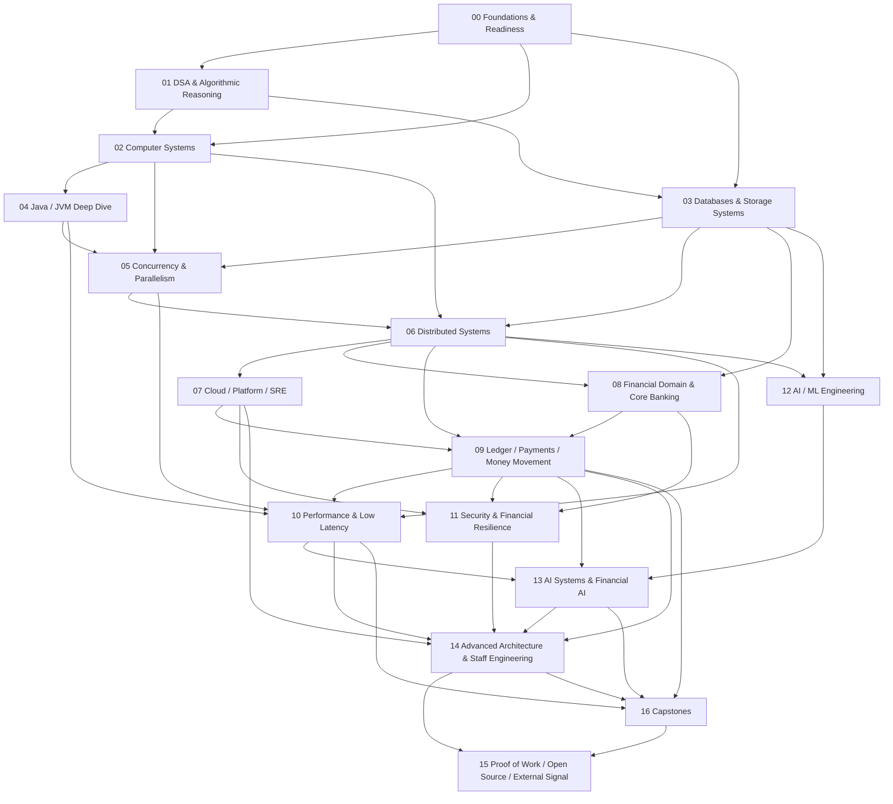

# Financial Infrastructure Engineering — Master Roadmap v1

> A capability-first curriculum for progressing from Senior Backend Engineer to Staff / Architect-level engineer at the intersection of **software engineering × systems × financial infrastructure × AI**.

## 0. How to use this roadmap

This is a **map, not a checklist**.

```text
Why does this exist?
        ↓
What are the prerequisites?
        ↓
What must I be able to explain?
        ↓
What must I be able to build / solve / measure?
        ↓
Can I already demonstrate it?
   ↙               ↘
SKIP             STUDY
                  ↓
                 PROOF
                  ↓
                 PASS
```

Professional experience is treated as a strong prior, not automatic proof of theoretical depth.

### Mastery levels

| Level | Meaning |
|---|---|
| L0 | Awareness |
| L1 | Foundation |
| L2 | Practitioner |
| L3 | Advanced |
| L4 | Senior |
| L5 | Staff |
| L6 | Expert / Architect |

### Evidence rule

Certificates may support the record, but **demonstrated capability is the primary evidence**: implementation, exercises, benchmarks, designs, incident analysis, technical writing, open-source work, or other observable artifacts.

---

# 1. Global dependency graph



The graph is intentionally non-linear: topics can be sampled early for context, but mastery follows dependency order.

---

# 2. Track 00 — Foundations & Readiness

**Question:** What must be true before advanced CS and systems material can be learned efficiently?

For an experienced backend engineer, most application-level foundations are assumed. This track is diagnostic-first.

## 00.1 Programming & Computational Fluency

- control-flow reasoning
- references / values
- recursion
- growth rates and logarithmic reasoning
- asymptotic analysis
- amortized analysis
- core data structures
- algorithm decomposition
- computational / memory reasoning

**Current status:** 🟡 Targeted remediation required.

## 00.2 Discrete Mathematics & Probability

- logic and propositions
- sets, relations and functions
- proof techniques
- induction
- combinatorics
- graphs
- modular arithmetic
- probability
- conditional probability
- random variables
- expectation and variance
- basic distributions

## 00.3 SQL & Relational Modeling

- relational model
- keys and constraints
- normalization
- joins
- transactions
- isolation
- indexes
- query plans
- basic locking

## 00.4 Linux & Engineering Environment

- processes
- filesystems
- permissions
- shell
- pipes / redirection
- process inspection
- signals
- sockets
- debugging tools
- profiling basics

## 00.5 Git & Reproducible Engineering

- object model
- branching
- rebasing
- merge strategies
- history inspection
- recovery
- bisect
- tags/releases
- reproducible workflows

## 00.6 Networking Fundamentals

- IP
- DNS
- TCP / UDP
- HTTP
- TLS
- sockets
- latency
- connection lifecycle
- basic load balancing

**Exit:** no blocking prerequisite gap for Track 01–03.

---

# 3. Track 01 — Data Structures & Algorithms

**Question:** How do we model problems and choose efficient representations and algorithms?

## 01.1 Complexity & Analysis

- growth rates
- O / Ω / Θ
- best / average / worst case
- time / space complexity
- amortized analysis
- lower bounds
- complexity of real code

## 01.2 Core Data Structures

- arrays / dynamic arrays
- linked structures
- stacks / queues / deques
- hash tables / sets
- trees / BSTs
- balanced trees
- heaps / priority queues
- tries
- graphs
- union-find

## 01.3 Searching & Sorting

- linear search
- binary search
- merge / quick / heap sort
- stability
- in-place algorithms
- partitioning
- external sorting concepts

## 01.4 Algorithmic Techniques

- invariants
- two pointers
- sliding window
- prefix sums
- hashing
- divide and conquer
- greedy
- recursion
- backtracking
- dynamic programming

## 01.5 Graph Algorithms

- BFS / DFS
- topological ordering
- shortest paths
- Dijkstra
- Bellman-Ford
- minimum spanning trees
- connectivity
- union-find

## 01.6 Algorithm Engineering

- correctness arguments
- complexity derivation
- adversarial inputs
- memory behavior
- cache awareness
- implementation trade-offs

**Evidence:** implementations, solved problems with explanations, correctness proofs, and selected benchmarks.

**Exit:** independent algorithmic reasoning rather than pattern memorization.

---

# 4. Track 02 — Computer Systems

**Question:** What actually happens beneath application-level abstractions?

## 02.1 Computer Architecture

- CPU execution model
- registers / instructions
- pipelines
- superscalar execution
- out-of-order execution
- branch prediction
- cache hierarchy / cache lines
- memory hierarchy
- virtual memory
- NUMA
- SIMD/vectorization basics

## 02.2 Operating Systems

- processes / threads
- scheduling
- context switching
- system calls
- virtual memory / paging
- filesystems
- I/O
- synchronization primitives
- signals

## 02.3 Networking Deep Dive

- TCP mechanics
- congestion / flow control
- retransmission
- connection management
- HTTP/1.1, HTTP/2, HTTP/3 / QUIC
- TLS
- proxies / load balancers
- connection pooling

## 02.4 Storage Fundamentals

- HDD / SSD behavior
- blocks / pages
- fsync
- write-ahead logging
- B-trees
- LSM trees
- compaction
- durability
- sequential vs random I/O

**Exit:** trace a request from application code through CPU, memory, OS, network and storage.

---

# 5. Track 03 — Databases & Storage Systems

**Question:** How do transactional data systems provide correctness, performance and durability?

## 03.1 Relational Internals

- storage engine architecture
- pages / buffers
- indexes
- B+ trees
- hashing
- scans
- joins
- sorting
- query execution
- query optimization

## 03.2 Transactions

- ACID
- isolation levels
- serializability
- locking
- MVCC
- deadlocks
- optimistic concurrency
- timestamp ordering

## 03.3 Recovery

- WAL
- checkpoints
- crash recovery
- redo / undo
- durability
- replication interactions

## 03.4 Distributed Databases

- partitioning
- replication
- distributed transactions
- consistency models
- distributed query execution

## 03.5 OLTP vs OLAP

- workload characteristics
- indexing
- columnar storage
- analytical execution
- HTAP trade-offs

## 03.6 Modern Storage

- LSM-based systems
- compaction
- key-value stores
- log-structured designs
- object storage
- event logs

**Exit:** explain and defend database choices for a transactional financial workload.

---

# 6. Track 04 — Java & JVM Deep Dive

**Question:** What does Java actually do at runtime, and how does that affect production behavior?

## 04.1 Modern Java

- collections internals
- generics / type erasure
- streams
- records
- sealed types
- pattern matching
- virtual threads

## 04.2 JVM

- class files
- class loading
- bytecode
- interpreter
- JIT
- profiling
- deoptimization

## 04.3 Memory

- object layout
- references
- allocation
- TLABs
- escape analysis
- stack vs heap
- off-heap memory

## 04.4 Garbage Collection

- generational GC
- G1
- ZGC
- Shenandoah concepts
- pause behavior
- allocation pressure
- tuning methodology

## 04.5 Java Memory Model

- visibility
- atomicity
- ordering
- happens-before
- volatile
- final fields

## 04.6 JVM Diagnostics

- JFR
- JMC
- heap dumps
- thread dumps
- async-profiler
- GC logs
- allocation profiling

**Exit:** diagnose runtime behavior from measurements rather than intuition.

---

# 7. Track 05 — Concurrency & Parallelism

**Question:** How do we execute work concurrently while preserving correctness and controlling contention?

## 05.1 Fundamentals

- concurrency vs parallelism
- processes vs threads
- shared state
- synchronization
- scheduling

## 05.2 Java Concurrency

- synchronized
- locks / conditions
- executors
- futures
- CompletableFuture
- concurrent collections
- ForkJoin
- structured concurrency

## 05.3 Memory & Atomicity

- Java Memory Model
- CAS
- atomics
- memory ordering
- false sharing
- cache coherence

## 05.4 Correctness

- race conditions
- deadlocks
- livelocks
- starvation
- linearizability
- progress guarantees

## 05.5 Advanced Concurrency

- lock-free structures
- wait-free concepts
- work stealing
- actor/message-passing models
- backpressure
- bounded queues

## 05.6 Financial Applications

- concurrent ledger posting
- idempotent processing
- payment state transitions
- high-throughput transaction handling

**Exit:** implement and defend concurrent components with explicit correctness arguments.

---

# 8. Track 06 — Distributed Systems

**Question:** How do we build correct systems when machines, networks, clocks and processes can fail independently?

## 06.1 Model & Failure

- distributed-system models
- crash failures
- network failures
- partitions
- partial failure
- failure detectors

## 06.2 Communication & Ordering

- RPC
- serialization
- timeouts
- retries
- clocks
- logical clocks
- causal ordering
- total ordering

## 06.3 Replication & Consistency

- primary/replica
- quorum
- strong consistency
- eventual consistency
- linearizability
- causal consistency
- read/write semantics

## 06.4 Consensus

- consensus problem
- Raft
- leader election
- log replication
- membership
- snapshots

## 06.5 Distributed Transactions

- 2PC
- saga patterns
- transactional messaging
- outbox / inbox
- idempotency
- deduplication
- exactly-once misconceptions

## 06.6 Distributed Data

- partitioning
- sharding
- replication
- rebalancing
- distributed queues
- streams

## 06.7 Observability & Failure

- tracing
- correlation
- retry storms
- circuit breakers
- backpressure
- recovery
- fault injection

**Exit:** design a distributed system with explicit consistency, failure and recovery semantics.

---

# 9. Track 07 — Cloud, Platform & SRE

**Question:** How do we operate mission-critical systems at scale?

## 07.1 Cloud Foundations

- AWS core services
- IAM
- networking
- compute
- storage
- managed databases
- messaging
- security

## 07.2 Containers & Kubernetes

- container runtime concepts
- images
- orchestration
- scheduling
- deployments
- services
- ingress
- autoscaling
- storage
- operators

## 07.3 Infrastructure as Code

- Terraform
- modules
- state
- drift
- environments
- policy

## 07.4 CI/CD & Release Engineering

- build pipelines
- testing
- artifacts
- deployment strategies
- canary / blue-green
- rollback
- progressive delivery

## 07.5 Observability

- metrics
- logs
- traces
- profiling
- OpenTelemetry
- alerting
- dashboards

## 07.6 SRE

- SLI / SLO / SLA
- error budgets
- incident response
- postmortems
- capacity planning
- reliability engineering
- disaster recovery
- RTO / RPO

## 07.7 Platform Engineering

- internal platforms
- golden paths
- developer experience
- policy as code
- self-service infrastructure

Financial workloads require explicit operational risk, regulatory, resilience and auditability considerations; AWS's current Financial Services Industry Lens is a useful external reference for this layer. citeturn0search0turn0search1turn0search2

**Exit:** deploy, observe, scale, secure and recover a production-like workload.

---

# 10. Track 08 — Financial Domain & Core Banking

**Question:** What exactly are we engineering when the system represents money and financial obligations?

## 08.1 Financial Foundations

- money as value
- currency
- minor units / precision
- FX
- accounts
- balances
- financial events
- obligations
- settlement

## 08.2 Banking Domain

- customer / party
- accounts
- account lifecycle
- products
- available balance
- ledger balance
- holds
- fees
- interest
- limits
- overdrafts
- end-of-day processing

## 08.3 Core Banking Architecture

- posting engine
- product engine
- account engine
- transaction engine
- batch processing
- real-time processing
- audit trail
- integration boundaries

## 08.4 Financial Controls

- segregation of duties
- auditability
- reconciliation
- financial controls
- operational controls
- regulatory concepts

## 08.5 Financial Market Infrastructure Context

- payment systems
- clearing
- settlement
- securities settlement
- central counterparties
- trade repositories
- settlement finality
- operational resilience

The BIS/CPMI-IOSCO PFMI provide the international reference framework for systemically important payment, clearing and settlement infrastructures and emphasize settlement finality, risk management, efficiency and communication standards. citeturn1search5turn1search7

**Exit:** model financial systems in domain terms before choosing technical architecture.

---

# 11. Track 09 — Ledger, Payments & Money Movement

**Question:** How do we build systems that can be trusted with money?

This is the **core specialization track**.

## 09.1 Double-Entry Ledger

- accounts
- debits / credits
- journal entries
- postings
- immutable ledger
- balance projection
- invariants
- account types
- normal balances
- reversals
- corrections
- auditability

Modern ledger systems such as Modern Treasury's Ledgers explicitly use immutable double-entry accounting, while TigerBeetle implements a purpose-built financial transaction database around accounts, transfers and ledgers. These are useful industry reference models, not substitutes for first-principles understanding. citeturn1search3turn1search6turn1search0

## 09.2 Ledger Correctness

- no accidental money creation/destruction
- atomic posting
- balanced entries
- uniqueness
- ordering
- idempotency
- immutability
- deterministic projections
- audit trail

## 09.3 Payment Lifecycle

- initiation
- authorization
- capture
- clearing
- settlement
- refund
- reversal
- chargeback
- dispute
- payment state machines

## 09.4 Payment Rails & Messaging

- cards
- bank transfers
- instant payments
- ACH-like systems
- RTGS concepts
- correspondent banking
- ISO 20022
- financial messaging

ISO 20022 is the international framework for structured financial messages across payments and other financial services; the 2026 edition continues the standard's metamodel and interoperability focus. citeturn1search4

## 09.5 Reconciliation

- internal reconciliation
- external reconciliation
- settlement reconciliation
- breaks
- unmatched transactions
- suspense accounts
- correction workflows
- reconciliation windows

## 09.6 Correctness Patterns

- idempotency keys
- deduplication
- retries
- transactional boundaries
- outbox / inbox
- state machines
- exactly-once misconceptions
- compensating actions

## 09.7 Advanced Financial Infrastructure

- multi-currency
- FX
- fees
- limits
- holds
- reserves
- settlement accounts
- netting
- liquidity
- exposure
- ledger partitioning
- high-throughput posting

**Primary proof-of-work:** `kora-core`.

**Exit:** design and implement a correct financial subsystem and defend its invariants, failure modes, reconciliation model and operational behavior.

---

# 12. Track 10 — Performance Engineering & Low Latency

**Question:** How do we turn correctness-first systems into measurable, predictable high-performance systems?

## 10.1 Methodology

- workload characterization
- hypotheses
- benchmarks
- profiling
- baselines
- regression analysis

## 10.2 Latency

- latency decomposition
- throughput
- utilization
- queueing
- tail latency
- p50 / p95 / p99 / p999
- latency budgets

## 10.3 CPU & Memory

- cache locality
- branch prediction
- allocation
- object layout
- GC
- NUMA
- SIMD concepts

## 10.4 Concurrency Performance

- lock contention
- false sharing
- atomic costs
- queues
- batching
- backpressure
- work stealing

## 10.5 JVM Performance

- JIT behavior
- GC tuning
- allocation elimination
- profiling
- JFR
- async-profiler

## 10.6 Low-Latency Systems

- predictable latency
- jitter
- allocation avoidance
- ring buffers
- lock-free designs
- kernel / syscall overhead
- network stack effects
- busy polling concepts
- CPU affinity concepts

## 10.7 Financial Applications

- payment authorization latency
- fraud decision latency
- transaction processing
- market data
- risk checks
- high-throughput ledger posting

**Exit:** make performance claims from reproducible measurements.

---

# 13. Track 11 — Security, Resilience & Financial Safety

**Question:** How do we prevent technical failures from becoming financial or systemic failures?

## 11.1 Application Security

- authentication
- authorization
- OAuth / OIDC
- secrets
- cryptography fundamentals
- secure APIs
- input validation

## 11.2 Infrastructure Security

- IAM
- network isolation
- encryption
- key management
- container security
- supply-chain security
- vulnerability management

## 11.3 Financial Security

- fraud
- account takeover
- payment abuse
- transaction limits
- velocity controls
- risk signals
- segregation of duties

## 11.4 Resilience

- failure domains
- backups
- disaster recovery
- RTO / RPO
- multi-region
- graceful degradation
- business continuity

## 11.5 Financial Integrity

- unauthorized posting
- replay attacks
- duplicate payments
- lost events
- inconsistent balances
- audit integrity
- forensic traceability

**Exit:** threat-model a financial system and show how security and resilience controls preserve financial correctness.

---

# 14. Track 12 — AI / ML Engineering Foundations

**Question:** What does an engineer need to understand to build AI systems rather than merely consume models?

## 12.1 Mathematics & ML Foundations

- vectors / matrices
- probability
- statistics
- optimization
- loss functions
- gradient descent
- overfitting
- evaluation

## 12.2 Deep Learning

- neural networks
- embeddings
- attention
- transformers
- training loops
- inference

## 12.3 LLM Fundamentals

- tokenization
- embeddings
- transformer architecture
- context windows
- next-token prediction
- pretraining
- post-training
- reasoning models

## 12.4 ML Systems

- datasets
- training pipelines
- model serving
- GPU fundamentals
- batching
- inference latency
- model/version management

**Exit:** explain the model/system boundary and build a basic measured ML/LLM pipeline.

---

# 15. Track 13 — AI Systems & Financial AI

**Question:** How do we build reliable AI-enabled systems under real production constraints?

## 13.1 LLM Application Engineering

- prompting
- structured outputs
- tool use
- function calling
- RAG
- embeddings
- vector search
- context engineering

## 13.2 Agent Systems

- planning
- tool execution
- state
- memory
- orchestration
- multi-agent patterns
- failure containment
- permissions

## 13.3 Evaluation

- offline evaluation
- task metrics
- hallucination measurement
- retrieval evaluation
- agent evaluation
- regression suites
- human evaluation

## 13.4 Production AI

- inference serving
- batching
- KV cache
- quantization
- caching
- routing
- observability
- cost
- latency
- reliability
- security

A current systems-oriented LLM roadmap similarly treats model internals, training, inference, serving, KV cache, quantization, RAG, agents, evaluation and production architecture as distinct layers rather than collapsing everything into prompt engineering. citeturn0search8

## 13.5 Financial AI

- fraud detection
- transaction anomaly detection
- risk scoring
- AML investigation support
- reconciliation assistance
- payment routing
- financial document intelligence
- operations intelligence
- developer productivity for financial systems

## 13.6 AI Governance

- privacy
- data lineage
- explainability
- model risk
- access control
- prompt injection
- data leakage
- evaluation gates
- human oversight

**Exit:** ship an evaluated AI-enabled financial engineering system with explicit quality, latency, cost, safety and security constraints.

---

# 16. Track 14 — Advanced Architecture & Staff Engineering

**Question:** How does an engineer move from solving assigned problems to defining systems, boundaries and technical direction?

## 14.1 System Design

- requirements decomposition
- domain modeling
- APIs
- events
- data architecture
- consistency
- partitioning
- replication
- caching
- queues
- storage

## 14.2 Reliability Architecture

- failure budgets
- redundancy
- recovery
- observability
- capacity
- degradation
- disaster recovery

## 14.3 Financial Architecture

Design and defend:

- payment processor
- payment orchestration
- ledger platform
- reconciliation engine
- core banking platform
- transaction processing engine
- settlement platform
- financial data platform

## 14.4 Architecture Trade-offs

For every decision:

```text
correctness
latency
throughput
availability
consistency
security
operability
cost
complexity
team capability
regulatory constraints
```

## 14.5 Staff Engineering

- technical strategy
- platform thinking
- architecture roadmaps
- migration strategy
- technical debt management
- organizational boundaries
- influence without authority
- mentoring
- design reviews
- written communication
- stakeholder alignment

## 14.6 Architecture Evidence

- ADRs
- architecture diagrams
- design reviews
- capacity models
- failure analysis
- migration plans
- benchmark reports

**Exit:** independently frame ambiguous problems, make durable architecture decisions, and defend them to technical and non-technical stakeholders.

---

# 17. Track 15 — Proof of Work & External Signal

**Question:** How do we make high-level competence externally legible?

## 15.1 Technical Writing

- monthly English technical articles
- architecture explainers
- benchmark reports
- deep dives
- failure analyses

## 15.2 Open Source

- `kora-core`
- upstream contributions
- issues / PRs
- design discussions
- documentation

## 15.3 Research Reproduction

- reproduce interesting systems papers
- reproduce performance results where practical
- document deviations

## 15.4 Public Engineering Evidence

- talks
- meetups
- conference submissions
- technical demos
- open-source releases

## 15.5 Career Signal

- targeted GitHub portfolio
- technical LinkedIn narrative
- Staff-level design portfolio
- references / recommendations
- certifications only where they add signal

**Exit:** external evidence supports the claim of Staff/Architect-level capability rather than relying on job title alone.

---

# 18. Track 16 — Integrated Capstones

The capstones deliberately combine tracks.

### Capstone A — `kora-core`

**Tracks:** 03 + 05 + 06 + 08 + 09 + 10

Build a production-grade wallet / ledger engine with:

- immutable double-entry ledger
- balance projection
- idempotency
- transaction state machine
- concurrent posting
- persistence
- recovery
- reconciliation
- benchmarks
- observability

### Capstone B — Payment Orchestration Platform

**Tracks:** 06 + 07 + 08 + 09 + 10 + 11

### Capstone C — Distributed Reconciliation Engine

**Tracks:** 03 + 06 + 07 + 09 + 10

### Capstone D — High-Throughput Transaction Processor

**Tracks:** 02 + 04 + 05 + 09 + 10

### Capstone E — Low-Latency Financial Event Engine

**Tracks:** 02 + 04 + 05 + 10

### Capstone F — AI Financial Operations System

**Tracks:** 09 + 12 + 13 + 14

### Capstone G — End-to-End Financial Infrastructure Platform

```text
API
→ payment orchestration
→ ledger
→ event stream
→ reconciliation
→ risk/AI
→ observability
→ cloud deployment
→ disaster recovery
```

Each capstone should contain:

- architecture diagram
- ADRs
- requirements
- invariants
- threat model
- tests
- failure injection
- benchmark suite
- observability
- operational runbook
- postmortem simulation
- technical article

---

# 19. External curriculum cross-checks

This roadmap is deliberately benchmarked against established systems curricula and primary financial-infrastructure references rather than being a list of fashionable technologies.

### Review 1 — Computer Science completeness

CMU's systems concentration spans operating systems, compilers, parallel architecture, distributed systems, networking and databases. Its distributed-systems course combines principles with implementing and debugging real distributed systems. CMU's advanced database course covers database architecture, query optimization, concurrency control, query execution, indexing, logging/recovery and distributed databases. citeturn0search11turn0search12turn0search4

**Result:** PASS — the roadmap has the major CS/system dependencies, with compiler/formal-method depth deliberately left as a v2 candidate rather than a mandatory core.

### Review 2 — Production / Staff engineering completeness

Google's SRE material covers SLOs, monitoring distributed systems, alerting, troubleshooting, incident response, postmortems and reliability-oriented software engineering. AWS Well-Architected provides a six-pillar architecture framework and a dedicated Financial Services Industry Lens covering resilience, operational excellence, regulatory concerns and financial workloads. OpenTelemetry provides the vendor-neutral instrumentation model for traces, metrics and logs. citeturn0search3turn0search9turn0search5turn0search2turn1search14

**Result:** PASS — the roadmap does not stop at coding and system design; it includes operating and recovering systems.

### Review 3 — Financial Infrastructure + AI differentiation

BIS/CPMI-IOSCO PFMI provide the domain-level reference for payment, clearing and settlement infrastructures. ISO 20022 provides the structured financial messaging layer. Modern Treasury and TigerBeetle provide useful industry reference models for double-entry financial data systems. For AI, the roadmap follows a systems-oriented progression from model foundations to inference, serving, retrieval, agents, evaluation and production constraints. citeturn1search5turn1search4turn1search3turn1search0turn0search8

**Result:** PASS with deliberate v2 deepening candidates around market infrastructure, risk/pricing, advanced AI systems and low-level systems programming.

---

# 20. Known v2 refinement candidates

These are intentionally not resolved in v1:

- compiler / language-runtime depth
- formal methods / verification
- advanced networking and kernel bypass
- eBPF
- Rust / systems programming
- C/C++ for low-level performance work
- market microstructure / trading systems
- securities / custody / post-trade systems
- risk engines and pricing
- AML / fraud domain depth
- regulatory technology
- cryptography depth
- hardware acceleration
- GPU programming
- distributed databases research
- stream processing internals
- event sourcing / CQRS trade-offs
- data engineering / lakehouse systems
- ML systems / MLOps depth
- model risk management
- AI agents and security

These should be promoted into the core only if they materially support the target role rather than because they are interesting.

---

# 21. Current status

| Track | Status |
|---|---|
| 00 Foundations | 🟡 In progress |
| 01 DSA | 🟡 Mapped |
| 02 Computer Systems | 🟡 Mapped |
| 03 Databases & Storage | 🟡 Mapped |
| 04 Java / JVM | 🟡 Mapped |
| 05 Concurrency | 🟡 Mapped |
| 06 Distributed Systems | 🟡 Mapped |
| 07 Cloud / Platform / SRE | 🟡 Mapped |
| 08 Financial Domain / Core Banking | 🟡 Mapped |
| 09 Ledger / Payments | 🟡 Mapped |
| 10 Performance / Low Latency | 🟡 Mapped |
| 11 Security / Resilience | 🟡 Mapped |
| 12 AI / ML Engineering | 🟡 Mapped |
| 13 AI Systems / Financial AI | 🟡 Mapped |
| 14 Architecture / Staff | 🟡 Mapped |
| 15 Proof of Work | 🟡 Mapped |
| 16 Capstones | 🟡 Mapped |

**Current learning position:** Track 00 → 00.1 Programming & Computational Fluency → targeted remediation required.

**Next refinement step:** convert each track into the same detailed template: `Why → prerequisites → dependency graph → mastery objectives → primary resources → alternatives → projects → evidence → validation gate`.
