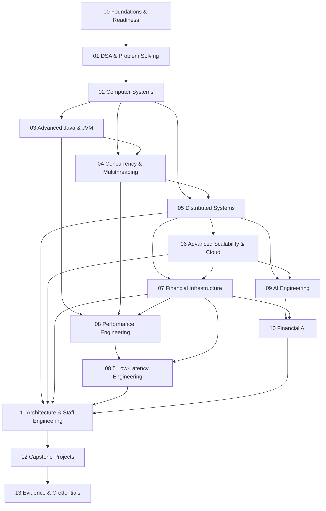

# Financial Infrastructure Engineering — Master Roadmap

> A capability roadmap for progressing from Senior Backend Engineer to Staff / Architect-level Financial Infrastructure Engineer, with depth across Computer Science, Systems, Finance, AI, Cloud, and Performance.

## How to use this roadmap

This is **not a course checklist**. It is a sequence of capability gates.

```text
Understand dependency
→ self-assess
→ SKIP if mastered
→ study only the gap
→ build / solve / benchmark
→ produce evidence
→ PASS
→ move forward
```

Professional experience is treated as a starting advantage, not as automatic proof of theoretical depth.

## Global dependency graph



---

# Track 00 — Foundations & Readiness

**Question:** What must be true before advanced systems concepts can be learned efficiently?

This track is intentionally selective for an experienced backend engineer.

### 00.1 Programming & Computational Fluency

- growth rates and logarithmic reasoning
- asymptotic analysis
- amortized analysis
- core data structures
- algorithm decomposition
- computational / memory reasoning

**Current status:** 🟡 Targeted remediation required.

### 00.2 Discrete Mathematics & Probability

- logic
- sets, relations, functions
- proof techniques
- induction
- combinatorics
- graphs
- modular arithmetic
- probability fundamentals
- random variables
- expected value

### 00.3 SQL & Relational Data Modeling

- relational model
- keys and constraints
- normalization
- joins
- query reasoning
- transactions
- indexes
- isolation
- query plans

### 00.4 Linux & CLI

- processes
- filesystems
- permissions
- shell tooling
- process inspection
- networking tools
- debugging / profiling basics

### 00.5 Git & Engineering Workflow

- object model
- branching
- rebasing
- merge strategies
- history inspection
- recovery
- reproducible workflows

### 00.6 Networking Fundamentals

- TCP/IP mental model
- DNS
- HTTP
- TLS
- sockets
- latency
- connection lifecycle
- basic load balancing

**Exit condition:** no blocking foundation gaps for Track 01.

---

# Track 01 — DSA & Problem Solving

**Question:** How do we model problems and choose efficient representations and algorithms?

```text
Complexity
→ Data structures
→ Searching / sorting
→ Recursion / backtracking
→ Trees
→ Heaps
→ Hashing
→ Graphs
→ Dynamic programming
→ Advanced algorithms
→ Problem-solving patterns
```

The objective is rigorous algorithmic reasoning, not interview-pattern memorization.

**Feeds:** Computer Systems, Distributed Systems, Performance, interviews.

**Exit condition:** solve, explain, analyze, test, and defend representative problems across major algorithmic families.

---

# Track 02 — Computer Systems

**Question:** What is actually happening beneath application-level abstractions?

```text
Computer architecture
→ CPU / caches / memory hierarchy
→ Operating systems
→ Processes / threads
→ Virtual memory
→ I/O
→ Networking
→ Storage systems
```

**Feeds:** JVM, concurrency, distributed systems, performance, low latency.

**Exit condition:** explain end-to-end request execution across application, CPU, memory, OS, network, and storage.

---

# Track 03 — Advanced Java & JVM

**Question:** How does the Java runtime behave, and how does that affect production systems?

```text
Modern Java
→ Collections / generics
→ JVM architecture
→ Bytecode
→ JIT compilation
→ Memory allocation
→ Garbage collection
→ Profiling
→ JVM observability
```

**Exit condition:** diagnose JVM behavior using measurements and runtime evidence rather than intuition.

---

# Track 04 — Concurrency & Multithreading

**Question:** How do we safely and efficiently execute work concurrently?

```text
Threads
→ Java Memory Model
→ happens-before
→ visibility / atomicity
→ synchronized / locks
→ atomics / CAS
→ concurrent collections
→ executors
→ ForkJoin / work stealing
→ contention
→ false sharing
→ lock-free algorithms
→ parallelism
```

**Financial applications:** concurrent ledger processing, payment state transitions, idempotency, high-throughput services.

**Exit condition:** design and implement concurrent components with explicit correctness and performance arguments.

---

# Track 05 — Distributed Systems

**Question:** How do we build correct systems when machines, networks, and processes can fail independently?

```text
Distributed-system model
→ failure models
→ clocks / ordering
→ RPC
→ replication
→ consistency
→ partitioning
→ consensus
→ distributed transactions
→ messaging
→ event-driven systems
→ fault tolerance
→ recovery
```

**Financial applications:** payment orchestration, settlement, reconciliation, distributed ledger services.

**Exit condition:** design systems under explicit failure and consistency constraints and defend the trade-offs.

---

# Track 06 — Advanced Scalability & Cloud

**Question:** How do systems scale while remaining reliable, observable, secure, and economically viable?

```text
Capacity planning
→ stateless services
→ load balancing
→ caching
→ queues / streams
→ database scaling
→ partitioning / sharding
→ autoscaling
→ containers
→ Kubernetes
→ cloud architecture
→ observability
→ SLOs / reliability
→ multi-region
→ disaster recovery
→ cost engineering
```

**Exit condition:** deploy, observe, scale, secure, and recover a production-like system.

---

# Track 07 — Financial Infrastructure

**Question:** How do we engineer systems that can be trusted with money?

```text
Financial domain model
→ core banking
→ accounts / balances
→ double-entry ledger
→ transaction posting
→ payment lifecycle
→ authorization / capture
→ settlement
→ reconciliation
→ fees / FX
→ limits / exposure
→ risk / fraud
→ compliance / auditability
→ financial data integrity
```

### Cross-cutting invariants

- no accidental money creation or destruction
- idempotent financial actions
- explicit state machines
- immutable accounting history
- transactional integrity
- auditability
- recoverability
- reconciliation

`kora-core` is the principal domain laboratory for this track.

**Exit condition:** design and implement a correct financial subsystem and explain its invariants, failure modes, reconciliation strategy, and operational behavior.

---

# Track 08 — Performance Engineering

**Question:** How do we measure and systematically improve system performance?

```text
Performance model
→ measurement
→ profiling
→ CPU behavior
→ memory behavior
→ cache locality
→ allocation
→ GC
→ JIT
→ synchronization costs
→ throughput / latency trade-offs
→ benchmarking
→ regression analysis
```

**Exit condition:** produce reproducible benchmarks and use measurements to drive engineering decisions.

---

# Track 08.5 — Low-Latency Engineering

**Question:** How do we build systems where predictable latency matters as much as throughput?

```text
Latency decomposition
→ tail latency
→ CPU cycles
→ cache locality
→ allocation avoidance
→ GC control
→ lock contention
→ lock-free structures
→ batching trade-offs
→ queues / ring buffers
→ networking
→ kernel / I/O effects
→ JVM low-latency techniques
→ end-to-end latency budgets
```

Applications:

- payment authorization
- market data
- trading infrastructure
- risk checks
- transaction processing
- high-throughput event pipelines

**Exit condition:** explain and measure an end-to-end latency budget and identify the dominant contributors.

---

# Track 09 — AI Engineering

**Question:** How do we build reliable AI systems rather than simply call models?

```text
ML foundations
→ data pipelines
→ model fundamentals
→ deep learning foundations
→ transformers
→ LLMs
→ embeddings
→ retrieval
→ RAG
→ tool use
→ agents
→ inference
→ evaluation
→ observability
→ security
→ cost / latency
→ production AI systems
```

**Exit condition:** ship an evaluated AI-enabled system with explicit reliability, latency, cost, and security trade-offs.

---

# Track 10 — Financial AI

**Question:** Where does AI create real value in financial infrastructure, and how do we deploy it safely?

Applications:

- fraud detection
- transaction anomaly detection
- risk scoring
- credit decisioning
- AML investigation support
- reconciliation automation
- operations intelligence
- financial document intelligence
- payment routing optimization
- forecasting

Engineering emphasis:

- correctness
- evaluation
- explainability where required
- monitoring
- latency
- security
- controlled failure

---

# Track 11 — Architecture & Staff Engineering

**Question:** How does an experienced engineer move from solving problems to defining systems and technical direction?

- architecture principles
- system design
- trade-off analysis
- architecture decision records
- technical strategy
- evolution of large systems
- organizational boundaries
- reliability strategy
- platform thinking
- technical leadership
- communication
- mentoring
- technical influence

**Exit condition:** independently frame ambiguous technical problems, establish constraints, make durable decisions, and communicate them across engineering and business stakeholders.

---

# Track 12 — Capstone Projects

Projects integrate multiple tracks and produce public evidence.

Candidate capstones:

1. production-grade double-entry ledger
2. payment orchestration platform
3. distributed reconciliation engine
4. high-throughput concurrent transaction processor
5. low-latency event-processing engine
6. cloud-native financial platform
7. AI-powered fraud/risk system
8. end-to-end financial infrastructure platform

Projects should include tests, benchmarks, architecture diagrams, ADRs, failure analysis, and technical documentation.

---

# Track 13 — Evidence & Credentials

**Question:** How do we make competence externally legible?

Evidence categories:

- certifications
- meaningful course completion
- university assignments
- GitHub projects
- benchmarks
- technical articles
- research reproductions
- open-source contributions
- conference / meetup talks
- architecture documents
- external reviews

Credentials are tracked separately from demonstrated capability.

---

## Mastery levels

| Level | Meaning |
|---|---|
| L0 | Awareness |
| L1 | Foundation |
| L2 | Practitioner |
| L3 | Advanced |
| L4 | Senior |
| L5 | Staff |
| L6 | Expert / Architect |

## Progression rules

1. **Experience is credit, not immunity.** Professional experience can justify skipping introductory material, but not advanced conceptual validation.
2. **No passive completion.** Watching a course is not evidence of mastery.
3. **One primary path per topic.** Alternatives are selected only when they add specific value.
4. **Free and accessible first.** Paid resources must justify their opportunity cost.
5. **Proof beats certificates.** Certificates supplement evidence; they do not replace demonstrated capability.
6. **Financial relevance is explicit.** Major systems concepts should eventually connect to financial infrastructure.
7. **Measure before optimizing.** Performance claims require reproducible measurements.
8. **Do not front-load everything.** Advanced prerequisites are learned when their dependency becomes active.

## Status

- [x] Curriculum architecture defined
- [x] Master dependency graph defined
- [x] Track 00 structure defined
- [ ] Track 00 detailed modules
- [ ] Track 01 detailed curriculum
- [ ] Track 02 detailed curriculum
- [ ] Track 03 detailed curriculum
- [ ] Track 04 detailed curriculum
- [ ] Track 05 detailed curriculum
- [ ] Track 06 detailed curriculum
- [ ] Track 07 detailed curriculum
- [ ] Track 08 detailed curriculum
- [ ] Track 08.5 detailed curriculum
- [ ] Track 09 detailed curriculum
- [ ] Track 10 detailed curriculum
- [ ] Track 11 detailed curriculum
- [ ] Capstone system
- [ ] Evidence system

**Current position:** Track 00 → 00.1 Programming & Computational Fluency → targeted remediation required.
