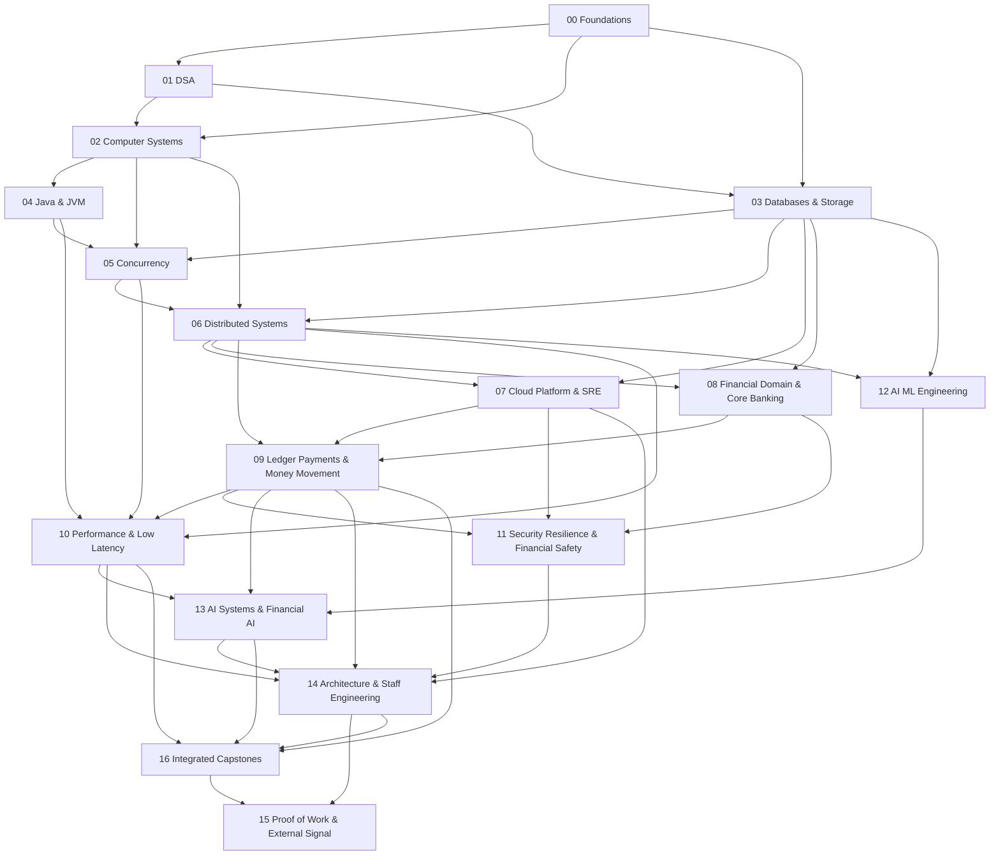

# Financial Infrastructure Engineering — Master Roadmap v1

> A capability-first curriculum for progressing from Senior Backend Engineer to Staff / Architect-level engineer at the intersection of **software engineering × systems × financial infrastructure × AI**.

## 0. How to use this roadmap

This is a **map, not a checklist**.

For every module:

```text
Why does it exist?
        ↓
What are the prerequisites?
        ↓
What must I understand?
        ↓
What must I be able to build / solve / measure?
        ↓
Can I already demonstrate it?
      ↙       ↘
    SKIP      STUDY
                ↓
              PROOF
                ↓
               PASS
                ↓
             NEXT
```

Professional experience is treated as a strong prior, not automatic proof of theoretical depth.

### Mastery levels

| Level | Meaning |
|---|---|
| L0 | Awareness |
| L1 | Foundation |
| L2 | Practitioner |
| L3 | Advanced |
| L4 | Senior |
| L5 | Staff |
| L6 | Expert / Architect |

### Evidence rule

Certificates can support the record, but **demonstrated capability is primary evidence**: implementation, exercises, benchmarks, designs, incident analysis, technical writing, open-source work, or other observable artifacts.

---

# 1. Global dependency graph



The graph is intentionally non-linear. Context can be sampled early, but mastery should follow dependency order.

---

# 2. Track 00 — Foundations & Readiness

**Question:** What must be true before advanced CS and systems material can be learned efficiently?

For an experienced backend engineer, application-level foundations are assumed where demonstrated; this track is diagnostic-first.

## 00.1 Programming & Computational Fluency
- control-flow reasoning
- values, references and memory model
- recursion
- growth rates and logarithms
- asymptotic analysis
- amortized analysis
- core data structures
- algorithm decomposition
- computational / memory reasoning

**Current status:** 🟡 targeted remediation required.

## 00.2 Discrete Mathematics & Probability
- logic and propositions
- sets, relations and functions
- proof techniques
- induction
- combinatorics
- graphs
- modular arithmetic
- probability
- conditional probability
- random variables
- expectation and variance
- basic distributions

## 00.3 SQL & Relational Modeling
- relational model
- keys and constraints
- normalization
- joins
- transactions
- isolation
- indexes
- query plans
- basic locking

## 00.4 Linux & Engineering Environment
- processes
- filesystems
- permissions
- shell
- pipes / redirection
- signals
- sockets
- process inspection
- debugging and profiling basics

## 00.5 Git & Reproducible Engineering
- object model
- branching
- rebasing
- merge strategies
- history inspection
- recovery
- bisect
- tags / releases
- reproducible workflows

## 00.6 Networking Fundamentals
- IP
- DNS
- TCP / UDP
- HTTP
- TLS
- sockets
- latency
- connection lifecycle
- basic load balancing

**Exit:** no blocking prerequisite gap for Tracks 01–04.

---

# 3. Track 01 — Data Structures & Algorithms

**Question:** How do we model problems and choose efficient representations and algorithms?

## 01.1 Complexity & Analysis
- growth rates
- O / Ω / Θ
- best / average / worst case
- time / space complexity
- amortized analysis
- lower bounds
- complexity of real code

## 01.2 Core Data Structures
- arrays / dynamic arrays
- linked structures
- stacks / queues / deques
- hash tables / sets
- trees / BSTs
- balanced trees
- heaps / priority queues
- tries
- graphs
- union-find

## 01.3 Searching & Sorting
- linear search
- binary search
- merge / quick / heap sort
- stability
- in-place algorithms
- partitioning
- external sorting concepts

## 01.4 Algorithmic Techniques
- invariants
- two pointers
- sliding window
- prefix sums
- hashing
- divide and conquer
- greedy
- recursion
- backtracking
- dynamic programming

## 01.5 Graph Algorithms
- BFS / DFS
- topological ordering
- shortest paths
- Dijkstra / Bellman-Ford
- minimum spanning trees
- connectivity

## 01.6 Algorithm Engineering
- correctness arguments
- complexity derivation
- adversarial inputs
- memory behavior
- cache awareness
- implementation trade-offs

**Evidence:** implementations, solved problems with explanations, correctness proofs and selected benchmarks.

**Exit:** independent algorithmic reasoning rather than pattern memorization.

---

# 4. Track 02 — Computer Systems

**Question:** What actually happens beneath application-level abstractions?

## 02.1 Computer Architecture
- CPU execution model
- registers / instructions
- pipelines
- superscalar and out-of-order execution
- branch prediction
- cache hierarchy / cache lines
- memory hierarchy
- virtual memory
- NUMA
- SIMD / vectorization basics

## 02.2 Operating Systems
- processes / threads
- scheduling
- context switching
- system calls
- virtual memory / paging
- filesystems
- I/O
- synchronization primitives
- signals

## 02.3 Networking Deep Dive
- TCP mechanics
- congestion / flow control
- retransmission
- connection management
- HTTP/1.1, HTTP/2, HTTP/3 / QUIC
- TLS
- proxies / load balancers
- connection pooling

## 02.4 Storage Fundamentals
- HDD / SSD behavior
- blocks / pages
- fsync
- write-ahead logging
- B-trees
- LSM trees
- compaction
- durability
- sequential vs random I/O

**Exit:** trace a request from application code through CPU, memory, OS, network and storage.

---

# 5. Track 03 — Databases & Storage Systems

**Question:** How do transactional data systems provide correctness, performance and durability?

## 03.1 Relational Internals
- storage engine architecture
- pages / buffers
- indexes
- B+ trees
- hashing
- scans
- joins
- sorting
- query execution
- query optimization

## 03.2 Transactions
- ACID
- isolation levels
- serializability
- locking
- MVCC
- deadlocks
- optimistic concurrency
- timestamp ordering

## 03.3 Recovery
- WAL
- checkpoints
- crash recovery
- redo / undo
- durability
- replication interactions

## 03.4 Distributed Databases
- partitioning
- replication
- distributed transactions
- consistency models
- distributed query execution

## 03.5 OLTP vs OLAP
- workload characteristics
- indexing
- columnar storage
- analytical execution
- HTAP trade-offs

## 03.6 Modern Storage
- LSM-based systems
- compaction
- key-value stores
- log-structured designs
- object storage
- event logs

**Exit:** explain and defend database choices for a transactional financial workload.

---

# 6. Track 04 — Java & JVM Deep Dive

**Question:** What does Java actually do at runtime, and how does that affect production behavior?

## 04.1 Modern Java
- collections internals
- generics / type erasure
- streams
- records
- sealed types
- pattern matching
- virtual threads

## 04.2 JVM
- class files
- class loading
- bytecode
- interpreter
- JIT
- profiling
- deoptimization

## 04.3 Memory
- object layout
- references
- allocation
- TLABs
- escape analysis
- stack vs heap
- off-heap memory

## 04.4 Garbage Collection
- generational GC
- G1
- ZGC
- Shenandoah concepts
- pause behavior
- allocation pressure
- tuning methodology

## 04.5 Java Memory Model
- visibility
- atomicity
- ordering
- happens-before
- volatile
- final fields

## 04.6 JVM Diagnostics
- JFR
- JMC
- heap dumps
- thread dumps
- async-profiler
- GC logs
- allocation profiling

**Exit:** diagnose runtime behavior from measurements rather than intuition.

---

# 7. Track 05 — Concurrency & Parallelism

**Question:** How do we execute work concurrently while preserving correctness and controlling contention?

## 05.1 Fundamentals
- concurrency vs parallelism
- processes vs threads
- shared state
- synchronization
- scheduling

## 05.2 Java Concurrency
- synchronized
- locks / conditions
- executors
- futures
- CompletableFuture
- concurrent collections
- ForkJoin
- structured concurrency

## 05.3 Memory & Atomicity
- Java Memory Model
- CAS
- atomics
- memory ordering
- false sharing
- cache coherence

## 05.4 Correctness
- race conditions
- deadlocks
- livelocks
- starvation
- linearizability
- progress guarantees

## 05.5 Advanced Concurrency
- lock-free structures
- wait-free concepts
- work stealing
- actor / message-passing models
- backpressure
- bounded queues

## 05.6 Financial Applications
- concurrent ledger posting
- idempotent processing
- payment state transitions
- high-throughput transaction handling

**Exit:** implement and defend concurrent components with explicit correctness arguments.

---

# 8. Track 06 — Distributed Systems

**Question:** How do we build correct systems when machines, networks, clocks and processes can fail independently?

## 06.1 Model & Failure
- distributed-system models
- crash failures
- network failures
- partitions
- partial failure
- failure detectors

## 06.2 Communication & Ordering
- RPC
- serialization
- timeouts
- retries
- clocks
- logical clocks
- causal ordering
- total ordering

## 06.3 Replication & Consistency
- primary / replica
- quorum
- strong consistency
- eventual consistency
- linearizability
- causal consistency
- read/write semantics

## 06.4 Consensus
- consensus problem
- Raft
- leader election
- log replication
- membership
- snapshots

## 06.5 Distributed Transactions
- 2PC
- saga patterns
- transactional messaging
- outbox / inbox
- idempotency
- deduplication
- exactly-once misconceptions

## 06.6 Distributed Data
- partitioning
- sharding
- replication
- rebalancing
- distributed queues
- streams

## 06.7 Observability & Failure
- tracing
- correlation
- retry storms
- circuit breakers
- backpressure
- recovery
- fault injection

**Exit:** design a distributed system with explicit consistency, failure and recovery semantics.

---

# 9. Track 07 — Cloud, Platform & SRE

**Question:** How do we operate mission-critical systems at scale?

## 07.1 Cloud Foundations
- AWS core services
- IAM
- networking
- compute
- storage
- managed databases
- messaging
- security

## 07.2 Containers & Kubernetes
- container runtime concepts
- images
- orchestration
- scheduling
- deployments
- services
- ingress
- autoscaling
- storage
- operators

## 07.3 Infrastructure as Code
- Terraform
- modules
- state
- drift
- environments
- policy as code

## 07.4 CI/CD & Release Engineering
- build pipelines
- testing
- artifacts
- deployment strategies
- canary / blue-green
- rollback
- progressive delivery

## 07.5 Observability
- metrics
- logs
- traces
- profiling
- OpenTelemetry
- alerting
- dashboards

## 07.6 SRE
- SLI / SLO / SLA
- error budgets
- incident response
- postmortems
- capacity planning
- reliability engineering
- disaster recovery
- RTO / RPO

## 07.7 Platform Engineering
- internal platforms
- golden paths
- developer experience
- policy enforcement
- self-service infrastructure

**Exit:** deploy, observe, scale, secure and recover a production-like workload.

---

# 10. Track 08 — Financial Domain & Core Banking

**Question:** What exactly are we engineering when the system represents money and financial obligations?

## 08.1 Financial Foundations
- money as value
- currencies
- minor units / precision
- FX
- accounts
- balances
- financial events
- obligations
- settlement

## 08.2 Banking Domain
- customer / party
- accounts and lifecycle
- products
- available vs ledger balance
- holds
- fees
- interest
- limits
- overdrafts
- end-of-day processing

## 08.3 Core Banking Architecture
- posting engine
- product engine
- account engine
- transaction engine
- batch processing
- real-time processing
- audit trail
- integration boundaries

## 08.4 Financial Controls
- segregation of duties
- auditability
- reconciliation
- operational controls
- regulatory concepts

## 08.5 Financial Market Infrastructure Context
- payment systems
- clearing
- settlement
- securities settlement
- central counterparties
- settlement finality
- operational resilience

**Exit:** model financial systems in domain terms before choosing technical architecture.

---

# 11. Track 09 — Ledger, Payments & Money Movement

**Question:** How do we build systems that can be trusted with money?

This is the **core specialization track**.

## 09.1 Double-Entry Ledger
- accounts
- debits / credits
- journal entries
- postings
- immutable ledger
- balance projection
- invariants
- account types
- normal balances
- reversals
- corrections
- auditability

## 09.2 Ledger Correctness
- balanced entries
- no accidental money creation / destruction
- atomic posting
- uniqueness
- ordering
- idempotency
- concurrency control
- deterministic projections

## 09.3 Payment Lifecycle
- initiation
- authorization
- capture
- clearing
- settlement
- refunds
- chargebacks
- disputes
- payment state machines

## 09.4 Payment Infrastructure
- payment orchestration
- PSP integrations
- routing
- retries
- idempotency keys
- tokenization concepts
- webhooks
- reconciliation

## 09.5 Money Movement
- transfers
- holds
- reservations
- fees
- FX
- settlement accounts
- liquidity

## 09.6 Reconciliation
- source-of-truth selection
- internal vs external records
- matching
- breaks
- exception handling
- replay
- operational workflows

## 09.7 Financial Messaging
- ISO 20022 concepts
- payment messages
- event schemas
- versioning
- backwards compatibility

**Primary proof-of-work:** progressively turn `kora-core` into a production-quality wallet / ledger engine.

**Exit:** design and implement a correct financial subsystem and defend its invariants, failure modes and reconciliation strategy.

---

# 12. Track 10 — Performance Engineering & Low Latency

**Question:** How do we make performance measurable, predictable and explainable?

## 10.1 Methodology
- hypothesis-driven optimization
- profiling before optimizing
- benchmark design
- workload modeling
- reproducibility

## 10.2 Latency
- p50 / p95 / p99 / p999
- tail latency
- coordinated omission
- latency budgets
- queueing effects

## 10.3 JVM Performance
- allocation pressure
- GC behavior
- JIT behavior
- object layout
- profiling

## 10.4 CPU / Memory
- cache locality
- cache lines
- branch prediction
- false sharing
- memory bandwidth
- NUMA
- vectorization

## 10.5 Concurrency Performance
- lock contention
- queueing
- thread scheduling
- work stealing
- backpressure

## 10.6 Network / I/O
- syscall overhead
- batching
- connection management
- serialization
- zero-copy concepts
- kernel networking concepts

## 10.7 Advanced Low Latency
- event-driven architecture
- bounded allocation
- object reuse
- kernel bypass concepts
- busy polling concepts
- affinity concepts
- specialized transports

**Exit:** produce reproducible benchmarks and use measurements to drive architecture decisions.

---

# 13. Track 11 — Security, Resilience & Financial Safety

**Question:** How do we protect systems whose failures can create financial, legal or systemic consequences?

## 11.1 Application Security
- authentication
- authorization
- session / token security
- secrets
- input validation
- secure APIs

## 11.2 Cryptography Fundamentals
- hashing
- MACs
- digital signatures
- symmetric / asymmetric encryption
- key management
- TLS

## 11.3 Distributed Security
- service identity
- mTLS
- zero-trust concepts
- workload identity
- supply-chain security

## 11.4 Financial Safety
- transaction authorization
- limits
- fraud controls
- replay protection
- audit trails
- segregation of duties
- tamper evidence

## 11.5 Resilience
- graceful degradation
- isolation
- bulkheads
- circuit breakers
- disaster recovery
- chaos / fault injection

## 11.6 Compliance Awareness
- PCI DSS concepts
- data protection
- audit requirements
- retention
- regulatory change management

**Exit:** threat-model and resilience-test a financial transaction system.

---

# 14. Track 12 — AI / ML Engineering

**Question:** What does it take to build reliable AI systems rather than merely call models?

## 12.1 ML Foundations
- supervised / unsupervised learning
- train / validation / test
- loss functions
- optimization
- overfitting
- evaluation
- feature engineering

## 12.2 Deep Learning
- neural networks
- backpropagation
- embeddings
- attention
- transformers

## 12.3 LLM Foundations
- tokenization
- context windows
- pretraining concepts
- instruction tuning
- alignment concepts
- inference

## 12.4 LLM Application Engineering
- prompting
- structured output
- tool calling
- RAG
- embeddings / vector search
- agents
- workflows

## 12.5 Evaluation
- offline evaluation
- task-specific metrics
- hallucination / grounding
- regression testing
- human evaluation
- safety evaluation

## 12.6 Production ML
- data pipelines
- feature / embedding pipelines
- model registry concepts
- versioning
- serving
- monitoring
- drift

**Exit:** build an evaluated AI feature with explicit quality, latency, cost and failure criteria.

---

# 15. Track 13 — AI Systems & Financial AI

**Question:** Where does AI create durable leverage in financial infrastructure?

## 13.1 Inference Systems
- batching
- dynamic batching
- KV cache
- quantization
- model parallelism concepts
- inference latency
- throughput
- GPU utilization

## 13.2 AI Infrastructure
- model serving
- routing
- caching
- observability
- evaluation pipelines
- model / prompt versioning
- cost engineering

## 13.3 RAG & Knowledge Systems
- retrieval architecture
- chunking
- indexing
- reranking
- grounding
- citation / provenance
- freshness

## 13.4 Agentic Systems
- tool use
- state
- planning
- workflow orchestration
- guardrails
- human-in-the-loop
- reliability

## 13.5 Financial AI Applications
- transaction intelligence
- fraud / risk support
- reconciliation assistance
- financial document processing
- operations intelligence
- developer productivity
- customer / analyst workflows

## 13.6 Financial AI Safety
- explainability
- auditability
- data leakage
- model risk
- adversarial inputs
- deterministic controls around probabilistic components

**Exit:** ship an evaluated AI-enabled financial system with explicit reliability, latency, cost, security and auditability trade-offs.

---

# 16. Track 14 — Advanced Architecture & Staff Engineering

**Question:** How does a strong engineer make high-leverage technical decisions across a system and an organization?

## 14.1 Requirements
- functional requirements
- non-functional requirements
- constraints
- capacity assumptions
- risk identification
- ambiguity reduction

## 14.2 Architecture
- domain boundaries
- service decomposition
- modular monoliths
- microservices
- event-driven systems
- API design
- data ownership

## 14.3 Distributed Architecture
- consistency choices
- partitioning
- replication
- messaging
- failure handling
- migration

## 14.4 Financial Architecture
- payment processor
- ledger platform
- reconciliation engine
- core banking platform
- payment orchestration
- transaction processing

## 14.5 Reliability / Operations
- SLO-driven design
- capacity planning
- observability
- disaster recovery
- incident architecture

## 14.6 Architecture Economics
- cost models
- build vs buy
- managed vs self-hosted
- operational burden
- technical debt
- migration cost

## 14.7 Staff-Level Technical Leadership
- technical strategy
- architecture reviews
- RFCs / ADRs
- cross-team influence
- standards
- mentoring
- roadmap shaping
- managing technical risk

**Exit:** defend architecture decisions under ambiguous requirements and realistic operational constraints.

---

# 17. Track 15 — Proof of Work, Open Source & External Signal

**Question:** How do we convert private competence into credible external evidence?

## 15.1 Core Artifact
- `kora-core`
- architecture documentation
- correctness model
- benchmarks
- test strategy
- failure model
- observability

## 15.2 Technical Writing
- monthly English technical articles
- deep-dive engineering notes
- architecture decision records
- benchmark reports
- incident / failure analyses

## 15.3 Open Source
- meaningful contributions
- issue investigation
- pull requests
- design discussions
- maintainer-quality communication

## 15.4 Public Technical Signal
- GitHub portfolio
- LinkedIn technical positioning
- talks / meetups
- conference submissions where appropriate
- technical demos

## 15.5 Career Evidence
- Staff-level impact stories
- architecture examples
- quantified engineering outcomes
- leadership examples
- international-market positioning

**Exit:** a coherent body of evidence supports the target Staff / Architect narrative.

---

# 18. Track 16 — Integrated Capstones

The capstones integrate multiple tracks instead of creating isolated toy projects.

## Capstone A — Production-grade Wallet / Ledger Engine

**Core:** `kora-core`

Must cover:
- double-entry ledger
- immutable postings
- balance projection
- idempotency
- concurrency
- persistence
- reconciliation
- API
- observability
- security
- benchmarks

## Capstone B — Payment Processing Platform

Must cover:
- payment state machine
- orchestration
- PSP abstraction
- retries
- idempotency
- webhooks
- settlement
- reconciliation
- failure recovery

## Capstone C — High-Throughput Transaction Processor

Must cover:
- concurrent ingestion
- ordering semantics
- partitioning
- backpressure
- batching
- latency measurement
- p99 optimization

## Capstone D — Financial AI System

Must cover:
- real financial use case
- RAG / tool use where justified
- evaluation
- grounding
- security
- cost
- inference latency
- human / deterministic controls

## Capstone E — Staff-Level Architecture Case

Produce a complete architecture package for a large financial platform:
- requirements
- capacity model
- domain model
- architecture
- data model
- consistency model
- failure model
- security model
- observability
- disaster recovery
- cost model
- ADRs
- migration plan

**Exit:** the portfolio demonstrates integrated Staff / Architect-level reasoning, not isolated topic completion.

---

# 19. Cross-cutting disciplines

These are not independent tracks; they recur throughout the curriculum.

### Engineering quality
- testing strategy
- property-based testing
- fuzzing
- static analysis
- code review
- API compatibility
- backward compatibility

### Reliability
- observability
- SLOs
- failure budgets
- incident response
- recovery testing

### Security
- threat modeling
- least privilege
- secrets
- supply-chain security
- data protection

### Performance
- measurement
- profiling
- benchmarking
- workload modeling
- capacity planning

### Communication
- technical writing
- diagrams
- RFCs
- ADRs
- architecture presentations

### Financial correctness
- invariants
- auditability
- reconciliation
- deterministic controls
- financial safety

---

# 20. Resource-selection policy

The curriculum is **resource-agnostic**. We select resources after the competency map is stable.

Priority order:

1. authoritative / primary sources
2. free university courses and open courseware
3. high-quality books that provide coherent structure
4. official documentation / standards
5. strong open-source repositories
6. high-signal technical talks / lectures
7. paid courses only when they provide a material advantage

For every major module, the final curriculum should identify:

```text
Primary resource
Backup / alternative
Why this resource
What to skip
Prerequisites
Expected output
Proof of mastery
```

---

# 21. What is deliberately not mandatory yet

Potential specialization branches that will be evaluated after the baseline roadmap:

- C / C++ systems programming
- Rust
- compiler / language-runtime internals
- eBPF
- kernel bypass
- advanced cryptography
- formal methods
- market microstructure
- trading systems
- securities / custody / post-trade
- pricing / risk engines
- GPU / hardware acceleration
- advanced stream processing
- data engineering / lakehouse systems
- MLOps at scale
- model risk management

These are candidates for strengthening or specialization, not automatic requirements.

---

# 22. Validation protocol

Each track will eventually receive:

### Review A — Coverage
Are the required concepts present?

### Review B — Dependency
Are concepts taught in a defensible order?

### Review C — Seniority
Does the depth match Senior → Staff / Architect rather than beginner material?

### Review D — Financial relevance
Does the curriculum create real Financial Infrastructure differentiation?

### Review E — Evidence
Can mastery be demonstrated through observable artifacts?

### Review F — Resource quality
Are the selected resources structured, accessible and worth the opportunity cost?

No track is considered final until these reviews are satisfied.

---

# 23. Current position

**Current track:** Track 00 — Foundations & Readiness

**Current module:** 00.1 Programming & Computational Fluency

**Status:** 🟡 targeted remediation required.

The global roadmap is intentionally broad at v1. We will now refine it iteratively, then work through the tracks in dependency order while allowing explicit skips for demonstrated mastery.
