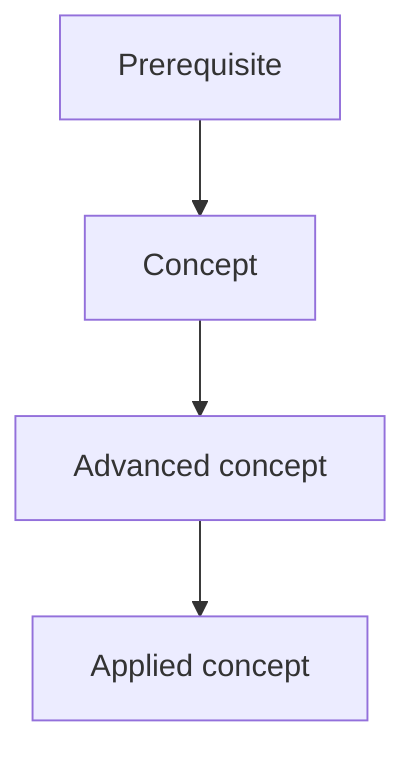

# Track / Module Template

> Copy this template when creating a new substantive track or module. Replace the placeholders and remove guidance text when appropriate.

## 1. Why this exists

What fundamental engineering problem does this domain address?

## 2. Why it matters for Financial Infrastructure Engineering

Explain the concrete connection to money movement, correctness, reliability, scale, latency, risk, compliance, or AI.

## 3. Prerequisites

List concepts that should already be understood and link to the relevant modules.

## 4. Why learn it now?

Explain the dependency relationship. What does this topic unlock later?

## 5. Learning objectives

By the end, the learner should be able to:

- ...
- ...
- ...

## 6. Fundamental questions

The questions the learner must eventually answer without notes.

1. Why does ...?
2. What happens if ...?
3. Why choose ... instead of ...?
4. What are the trade-offs?
5. How does this behave under failure/concurrency/scale?
6. Where does this matter in financial infrastructure?

## 7. Concept dependency graph

## 8. Concepts in learning order

### 8.1 First concept

- mental model
- key mechanisms
- common misconceptions
- prerequisites

### 8.2 Next concept

...

## 9. Primary resource

**Resource:** [Name](URL)

**Why this is the primary path:**

- structure
- depth
- practice
- accessibility
- relevance

**Known limitations:**

- ...

## 10. Supporting resources

| Resource | Type | Why use it | Cost / access | When to use |
|---|---|---|---|---|
| ... | Course / Book / Repo / Video / Paper | ... | ... | ... |

## 11. Practice and labs

Exercises should progress from isolated concepts to integrated systems.

### Exercises

- ...

### Labs

- ...

### Capstone integration

- ...

## 12. Failure modes and misconceptions

Document mistakes that commonly produce incorrect designs or misleading intuition.

## 13. Financial infrastructure applications

Show concrete applications such as:

- ledger
- payments
- reconciliation
- settlement
- risk
- core banking
- high-throughput transaction processing

## 14. Staff-level expectations

Describe what changes between:

- Practitioner
- Senior
- Staff
- Architect / Expert

## 15. Proof of mastery

Define objective completion criteria.

Examples:

- implement ...
- benchmark ...
- reproduce ...
- explain ...
- design ...
- diagnose ...

## 16. Evidence to publish

Potential public artifacts:

- GitHub project
- benchmark report
- architecture decision record
- technical article
- research reproduction
- open-source contribution

## 17. Further research

Only include material that meaningfully extends the primary path.
